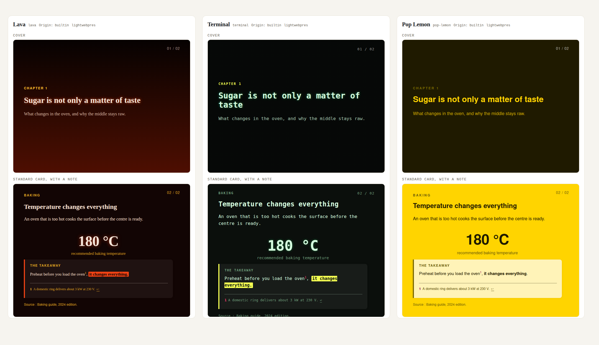

<!-- lwp:meta -->
page_title: L’apparence sans réécrire le contenu — LightWebPres
page_desc: Thèmes, presets et kits : trois rôles distincts, un choix visible.
card_title: L’apparence sans réécrire le contenu
card_desc: Thèmes, presets et kits : trois rôles distincts, un choix visible.
card_label: 04 / PERSONNALISER
nav_title: L’apparence sans réécrire le contenu
nav_desc: Thèmes, presets et kits : trois rôles distincts, un choix visible.
---

<!-- lwp:slide:cover -->
slug: ouverture
kicker: 04 / PERSONNALISER
# Changez la forme.<br>Gardez vos idées.
summary: Un thème règle des propriétés visuelles. Un preset choisit une présentation. Un kit porte une identité autonome.

---

<!-- lwp:slide -->
slug: themes
kicker: COMMENCEZ PAR UNE COULEUR
## Les thèmes se jugent sur de vraies pages.
summary: La galerie générée par le moteur montre chaque thème sur plusieurs composants, avec des filtres par famille, polarité et teinte.
source: <a href="reference/README.md">README · Choose a look</a>.



<div class="lwp-web-actions"><a class="lwp-web-button" href="themes.html">Explorer la galerie interactive ↗</a></div>

Sur cette page, appuyez sur **C** pour essayer les apparences publiées, dont les thèmes **Encre & citron** et **Papier & olive** du site.

---

<!-- lwp:slide -->
slug: trois-niveaux
kicker: LE BON NIVEAU DE CHOIX
## Identité, preset, thème : pas trois synonymes.
summary: Une seule référence de preset est persistée dans series.json. L’identité est déduite de cette référence.
source: <a href="reference/agent/skills/lightwebpres/SKILL.md">Skill de format · Identities, presets and themes</a>.

| Notion | Ce qu’elle choisit |
| --- | --- |
| Identité | Le cadre qui possède les ressources : native, Commons ou kit. |
| Preset | Les dispositions, le chrome et le thème initial pour la série. |
| Thème | Des couleurs, tailles et autres propriétés typées. |

La référence de ce site est `lightwebpres-site@1.0.0/web`. Son kit est dans `website/templates/kits/` ; ce n’est pas un second moteur de rendu.

---

<!-- lwp:slide -->
slug: changer-theme
kicker: DEUX COMMANDES
## Une nouvelle sélection, puis un nouveau build.
summary: La commande de thème change la sélection, sans effacer les propriétés que vous avez épinglées.
source: <a href="guide/guide.html#5-choose-presets-themes-and-customization">Guide · Presets, themes and customization</a>.

```bash
python3 lightwebpres series theme set ma-serie --theme evergreen
python3 lightwebpres build ma-serie --lang fr
```

Le sélecteur **C** permet aussi au lecteur de changer de thème, parmi ceux embarqués, sans reconstruire les pages. Les alternatives essentielles sont incluses par défaut.

---

<!-- lwp:slide -->
slug: personnaliser
kicker: SÉPARER LES RESPONSABILITÉS
## Les valeurs dans le thème. Les règles dans le CSS.
summary: Réglez d’abord les propriétés typées. Réservez custom.css aux règles avancées.
source: <a href="guide/guide.html#5-choose-presets-themes-and-customization">Guide · Change the whole series et Rules rather than values</a>.

`templates/settings.conf` épingle des valeurs pour toute la série. Les clés `style.*` du bloc meta agissent sur un article. Le kit peut apporter des dispositions et des assets ; `templates/custom.css` reste la couche CSS finale.

Un nom de propriété ou une valeur invalide arrête le build. Le rapport de contraste mesure les valeurs typées résolues, **pas le CSS avancé**, et n’est pas une certification d’accessibilité.

<div class="lwp-web-actions"><a href="downloads/site-sources.zip" download>Inspecter le kit de ce site ↓</a></div>

---

<!-- lwp:slide:series-nav -->
slug: continuer
