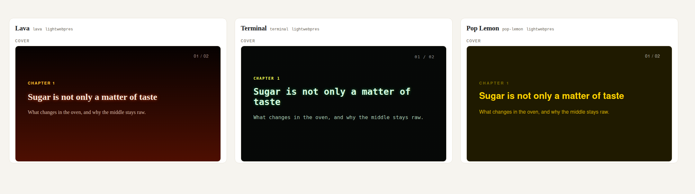

<!-- lwp:meta -->
page_title: Change the look, not the content — LightWebPres
page_desc: Themes, presets and kits: three distinct roles, one visible choice.
card_title: Change the look, not the content
card_desc: Themes, presets and kits: three distinct roles, one visible choice.
card_label: 04 / CUSTOMIZE
nav_title: Change the look, not the content
nav_desc: Themes, presets and kits: three distinct roles, one visible choice.
---

<!-- lwp:slide:cover -->
slug: ouverture
kicker: 04 / CUSTOMIZE
# Change the form.<br>Keep your ideas.
summary: A theme sets visual properties. A preset selects a presentation. A kit carries a self-contained identity.

---

<!-- lwp:slide -->
slug: comparer-identites
## One article. Three identities.
summary: Compare a simple starting point, a documentation identity and a field notebook.

<div class="lwp-web-actions"><a class="lwp-web-button" href="concepts/native/first-page.html#travels-with-the-page">Original ↗</a><a class="lwp-web-button" href="concepts/docs/first-page.html#travels-with-the-page">Documentation ↗</a><a class="lwp-web-button" href="concepts/field-notes/first-page.html#travels-with-the-page">Field Notes ↗</a></div>

---

<!-- lwp:slide -->
slug: composer
## An identity can bring several contributions together.
summary: Field Notes assembles a frame, a signature and a theme into a self-contained kit.

One designer can supply the layout; another the marks; another the typography and colours. The composed kit contains the selected resources: recipients do not need to find its source kits.

<div class="lwp-web-actions"><a href="concepts/field-notes/first-page.html#travels-with-the-page">Explore Field Notes →</a><a href="downloads/identity-examples.zip">Get the sources of all three examples ↓</a></div>

---

<!-- lwp:slide -->
slug: themes
kicker: START WITH A COLOUR
## Judge themes on actual pages.
summary: The engine-generated gallery shows every theme across several components, with filters for family, polarity and hue.
source: <a href="reference/README.md">README · Choose a look</a>.



<div class="lwp-web-actions"><a class="lwp-web-button" href="themes.html">Explore the interactive gallery ↗</a></div>

Open **Appearance** from the reader menu (or press **C**) to try the published appearances, including the site's **Ink & lemon** and **Paper & olive** themes.

---

<!-- lwp:slide -->
slug: trois-niveaux
kicker: THE RIGHT LEVEL OF CHOICE
## Identity, preset, theme: not three synonyms.
summary: A single preset reference is stored in series.json. The identity is inferred from that reference.
source: <a href="reference/agent/skills/lightwebpres/SKILL.md">Format skill · Identities, presets and themes</a>.

| Concept | What it selects |
| --- | --- |
| Identity | The framework that owns the resources: native, Commons or a kit. |
| Preset | Layouts, chrome and the initial theme for the series. |
| Theme | Colours, sizes and other typed properties. |

This site's reference is `lightwebpres-site@1.0.0/web`. Its kit lives in `website/templates/kits/`; it is not a second rendering engine.

---

<!-- lwp:slide -->
slug: changer-theme
kicker: TWO COMMANDS
## A new selection, then a new build.
summary: The theme command changes the selection without removing the property values you have pinned.
source: <a href="guide/guide.html#5-choose-presets-themes-and-customization">Guide · Presets, themes and customization</a>.

```bash
python3 lightwebpres series theme set my-series --theme evergreen
python3 lightwebpres build my-series --lang en
```

The **C** picker also lets readers choose among the bundled themes without rebuilding the pages. Essential alternatives are included by default.

---

<!-- lwp:slide -->
slug: personnaliser
kicker: SEPARATE RESPONSIBILITIES
## Values in the theme. Rules in CSS.
summary: Set typed properties first. Reserve custom.css for advanced rules.
source: <a href="guide/guide.html#5-choose-presets-themes-and-customization">Guide · Change the whole series and Rules rather than values</a>.

`templates/settings.conf` pins values for the whole series. The `style.*` keys in a meta block affect one article. A kit can provide layouts and assets; `templates/custom.css` remains the final CSS layer.

An invalid property name or value stops the build. The contrast report measures resolved typed values, **not advanced CSS**, and is not an accessibility certification.

<div class="lwp-web-actions"><a href="downloads/site-sources.zip" download>Inspect this site's kit ↓</a></div>

---

<!-- lwp:slide:series-nav -->
slug: continuer
