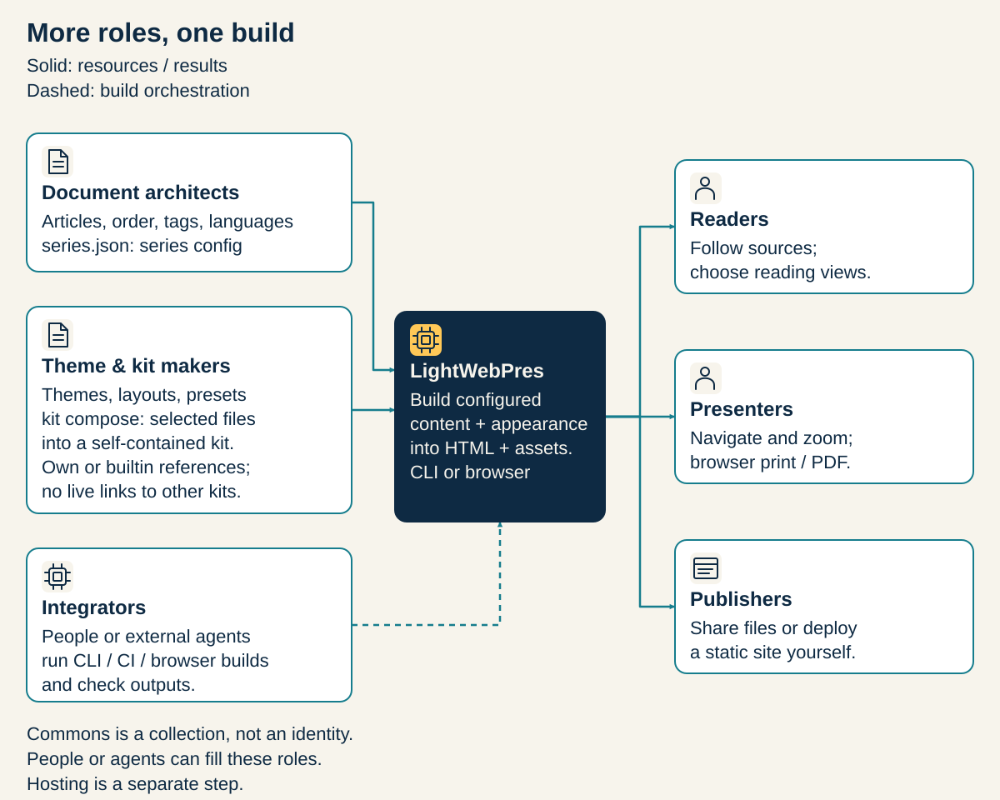
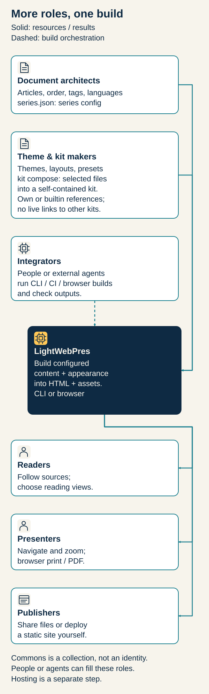

<!-- lwp:meta -->
page_title: Find your use case — LightWebPres
page_desc: Read, write, organize, design, automate and publish. Follow a route built around your work.
card_title: Find your use case
card_desc: Read, write, organize, design, automate and publish. Follow a route built around your work.
card_label: 02 / USE CASES
nav_title: Find your use case
nav_desc: Read, write, organize, design, automate and publish. Follow a route built around your work.
---

<!-- lwp:slide:cover -->
slug: ouverture
kicker: YOUR WORK COMES FIRST
# What will you make possible?
summary: Read, write, organize, design, automate and publish. Follow a route built around your work.

---

<!-- lwp:slide -->
slug: read
kicker: Read and present
## Give the room the overview. Keep the detail within reach.
summary: For a reader, speaker or facilitator

A briefing before a meeting, a course during a session, a reference afterwards. Your audience opens the same pages in a browser: they do not need the generator or a presentation-service account. On a phone they scroll; on a larger screen they can follow the cards. Long content stays available instead of being cut to fit a slide.

---

<!-- lwp:slide -->
slug: read-start
kicker: Read and present
## See it. Then make it yours.

Open the example, move between the cards, then jump to the complete article. In the reader menu, try the zoom buttons, text fitting and local scrolling for a wide table. Share a section when you want somebody to start at a precise point.

<a class="lwp-web-button" href="demo/library.html">Open the briefing →</a>

---

<!-- lwp:slide -->
slug: write
kicker: Write and explain
## A presentation people can return to.
summary: For an author, teacher, researcher or analyst

Prepare a course, a research brief or a project update without maintaining a disconnected slide deck and handout. Write the main ideas as cards and keep the explanation, references and longer text in the same article project. You decide the argument and the level of detail; LightWebPres renders the structure you provide.

---

<!-- lwp:slide -->
slug: write-start
kicker: Write and explain
## See it. Then make it yours.

Work in your usual text editor, guide an external agent, or give an agent a bounded task. All three paths produce editable sources. Start from the downloadable example; the browser builder can turn that source project into pages without a local Python installation. It builds files, rather than offering a WYSIWYG editor.

<a class="lwp-web-button" href="demarrer.html#navigateur">Choose a way to create →</a>

---

<!-- lwp:slide -->
slug: organize
kicker: Organize knowledge
## Reuse the article. Change the journey.
summary: For a documentation owner or collection editor

A course has modules. Documentation has topics. A briefing selects only what its audience needs. LightWebPres lets a series select and order articles while the source of each article remains reusable. The same canonical text can belong to a short briefing and to a larger reading collection, with context-specific titles and descriptions.

---

<!-- lwp:slide -->
slug: organize-start
kicker: Organize knowledge
## See it. Then make it yours.

Explore the index of this site, open a chapter and use its series navigation. A series file records the selection and order. After editing a shared article, rebuild every series that uses it. Content tags can select variants you have written; they neither translate content nor control who is allowed to read it.

<a class="lwp-web-button" href="ecrire.html#serie">Explore articles and series →</a>

---

<!-- lwp:slide -->
slug: design
kicker: Design an identity
## Keep the content. Make the presentation yours.
summary: For a designer or a team with a visual language

Choose colors and typography with a theme. Use a preset to select an arrangement of appearance choices. When you need layouts, marks, headers and footers together, create an Identity Kit that another author can reuse. A composed kit is self-contained: its recipients need the delivered kit, not a chain of its source kits.

---

<!-- lwp:slide -->
slug: design-start
kicker: Design an identity
## See it. Then make it yours.

Open the appearance chooser in a document and compare the same content under the choices it includes. Browse the gallery for a wider view, then follow the appearance chapter to move from using a theme to building a reusable identity. Only choices included in the published document are available to its reader.

<a class="lwp-web-button" href="apparence.html">Explore appearance →</a>

---

<!-- lwp:slide -->
slug: automate
kicker: Automate a workflow
## Turn a repeatable job into a repeatable document.
summary: For a developer, integrator or agent operator

Generate recurring project reports, update a documentation collection or give an agent a precise publishing task. The command line works with ordinary source files and structured reports. Build the pages, inspect source warnings and compare the output with a fresh render before handing it over. Generation, checking and publication remain distinct steps.

---

<!-- lwp:slide -->
slug: automate-start
kicker: Automate a workflow
## See it. Then make it yours.

Give an external agent the format skill, the files it may edit and the checks it must run. Keep published slugs stable. Add the optional sourced-presentation method when you need a structured editorial workflow. LightWebPres does not supply the agent or verify the truth of its research; review content and untrusted HTML before publishing.

<a class="lwp-web-button" href="demarrer.html#terminal">Open the CLI route →</a>

---

<!-- lwp:slide -->
slug: publish
kicker: Publish and keep
## A document to hand over, not a service to keep renting.
summary: For a maintainer, community or independent author

Deliver a folder of pages and resources, publish it on static hosting or include it in an existing website. Readers use their browser; the source project stays with you for future edits and backups. Each article carries its own CSS and JavaScript. Referenced images and kit assets must travel with the output directory.

---

<!-- lwp:slide -->
slug: publish-start
kicker: Publish and keep
## See it. Then make it yours.

Download the example project to see what belongs to the author and what goes to the reader. Inspect the generated pages before publishing. The browser can print them to PDF; inspect the result rather than assuming identical pagination everywhere. LightWebPres generates the files; you choose their hosting and who can reach it.

<a class="lwp-web-button" href="publier.html">Prepare a delivery →</a>

---

<!-- lwp:slide -->
slug: roles-ensemble
## Roles that work together.
summary: Content and appearance resources meet at the same engine. Publishing remains a separate choice.

---

<!-- lwp:slide:series-nav -->
slug: continuer
