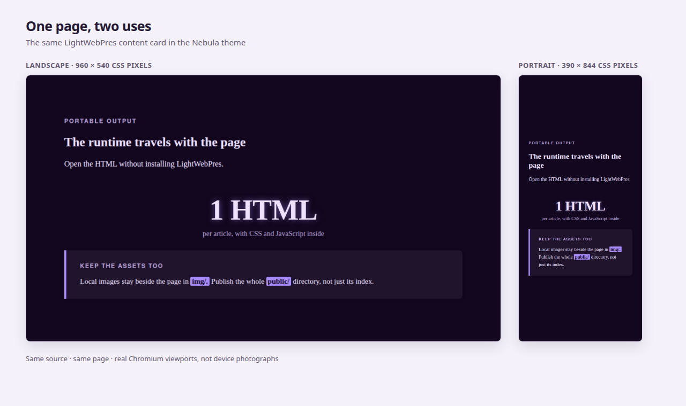

<!-- lwp:meta -->
page_title: Un document pour tout le parcours — LightWebPres
page_desc: Lire la vue d’ensemble, explorer les détails et choisir comment créer.
card_title: Un document pour tout le parcours
card_desc: Lire la vue d’ensemble, explorer les détails et choisir comment créer.
card_label: 01 / DÉCOUVRIR
nav_title: Un document pour tout le parcours
nav_desc: Lire la vue d’ensemble, explorer les détails et choisir comment créer.
---

<!-- lwp:slide:cover -->
slug: ouverture
# Avant l’exposé. Pendant. Et après.
summary: Lire la vue d’ensemble, explorer les détails et choisir comment créer.  <a class="lwp-web-button" href="demo/library.html">Ouvrir l’exemple →</a>

---

<!-- lwp:slide -->
slug: pour-qui
## Commencez par votre intention.
summary: Un cours, un dossier, une collection ou une identité à partager.

Le lecteur a besoin d’un parcours clair ; l’auteur, de sources modifiables ; le designer, de choix réutilisables ; le mainteneur, d’un livrable à conserver et reconstruire. Une même personne peut tenir tous ces rôles ; un agent peut aussi participer au travail.

<a class="lwp-web-button" href="usages.html">Explorer les six parcours →</a>

---

<!-- lwp:slide -->
slug: deux-usages
## La vue d’ensemble et les détails restent ensemble.
summary: Les fiches guident une présentation. L’article complet accueille son développement.

Ouvrez le dossier de bibliothèque pour découvrir une proposition, son tableau comparatif et la note de travail complète. Suivez les fiches ou allez directement au texte long. Vous choisissez la profondeur utile.

<a class="lwp-web-button" href="demo/library.html#detail">Lire la note complète →</a>

---

<!-- lwp:slide -->
slug: du-sommaire-au-detail
## Choisissez la profondeur. Gardez vos repères.
summary: Un sommaire relie les idées principales, le comparatif et la note de travail complète.

Ouvrez le sommaire de l’exemple. Choisissez une fiche pour la vue d’ensemble ou la note pour les explications. Le moteur produit les entrées et leurs liens depuis l’article ; l’auteur n’a pas à entretenir une seconde liste à la main.

<a href="demo/library.html#lwp-index">Explorer le sommaire →</a> · <a href="demo/library.html#detail">Lire la note complète →</a>

---

<!-- lwp:slide -->
slug: commandes
## Un menu lecteur. Pas une obligation de clavier.
summary: Sur téléphone, touchez le menu pour accéder au zoom − / + / Réinitialiser, à l’ajustement du texte et au défilement des tableaux.

Le zoom de présentation agrandit le document. Le pincement reste le zoom de votre navigateur. L’aide propose les gestes tactiles et les raccourcis clavier. Les commandes permettent aussi de changer d’apparence ou de partager la fiche courante.

---

<!-- lwp:slide -->
slug: une-source
## Gardez la matière que vous pouvez modifier.
summary: Les sources Markdown, les images et un fichier de série décrivent le document.

Écrivez vous-même, guidez un agent externe ou automatisez une construction. Le constructeur navigateur et la ligne de commande utilisent le même moteur. Ils ne choisissent pas votre argumentation et ne fournissent pas d’agent de rédaction.

<a class="lwp-web-button" href="demarrer.html">Choisir votre point de départ →</a>

---

<!-- lwp:slide -->
slug: fichiers-libres
## Transmettez un document, pas le générateur.
summary: Le lecteur ouvre le HTML dans un navigateur. Conservez les images référencées et les ressources des kits avec les pages.

Publiez le dossier de sortie complet sur un hébergement statique, ou transmettez directement les fichiers. Gardez le projet source pour les modifications et les reconstructions.

<a class="lwp-web-button" href="publier.html">Préparer votre publication →</a>

---

<!-- lwp:slide -->
slug: deux-livraisons
## Une collection. Deux façons de la transmettre.
summary: Les mêmes sources produisent des pages web reliées ou une série réunie dans un HTML.

Le site convient à une collection publiée à une adresse stable. Le HTML unique convient à un document à envoyer ou conserver : son index permet de choisir explicitement un article. Ces deux livraisons gardent les mêmes sources et la même identité réutilisable.

<a href="demo/index.html">Explorer l’exemple multipage →</a> · <a href="downloads/publication.html" download>Télécharger la même série en HTML ↓</a>

---

<!-- lwp:slide -->
slug: portrait-landscape
## Une page, deux contextes de lecture.

---

<!-- lwp:slide:series-nav -->
slug: continuer
