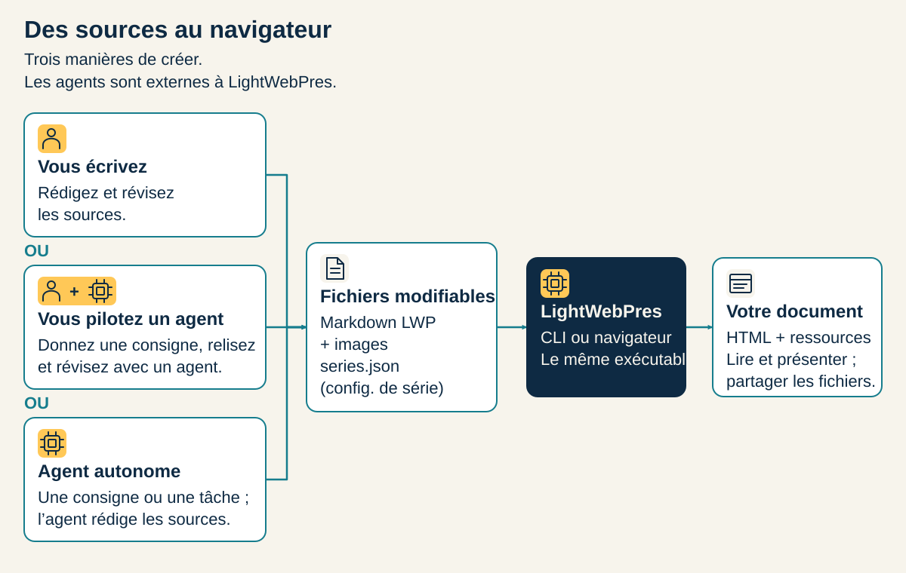
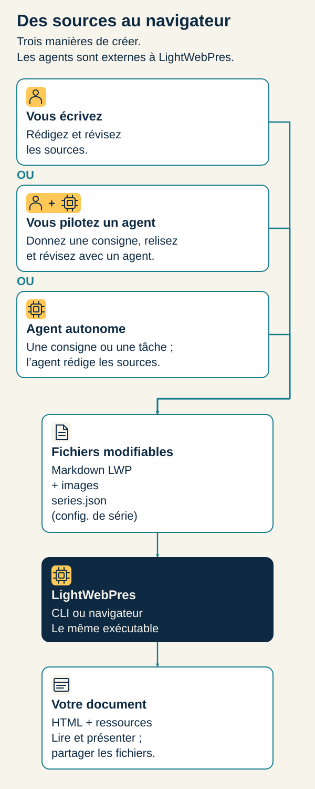

<!-- lwp:meta -->
page_title: Choisissez comment créer — LightWebPres
page_desc: Navigateur, agent externe ou éditeur et ligne de commande : choisissez le chemin adapté à votre tâche.
card_title: Choisissez comment créer
card_desc: Navigateur, agent externe ou éditeur et ligne de commande : choisissez le chemin adapté à votre tâche.
card_label: 03 / CRÉER
nav_title: Choisissez comment créer
nav_desc: Navigateur, agent externe ou éditeur et ligne de commande : choisissez le chemin adapté à votre tâche.
---

<!-- lwp:slide:cover -->
slug: ouverture
# Partez de votre<br>façon de travailler.
summary: Navigateur, agent externe ou éditeur et ligne de commande : choisissez le chemin adapté à votre tâche.


---

<!-- lwp:slide -->
slug: navigateur
## Construisez dans votre navigateur.
summary: Partez d’un projet source. Récupérez un dossier de pages.

Téléchargez le projet d’exemple, ouvrez le constructeur navigateur et sélectionnez son ZIP. Choisissez la langue de sortie et construisez. L’archive générée contient les pages à ouvrir ou publier. Les constructions ZIP s’exécutent dans cet onglet, sans envoi des sources à un service de compilation. C’est un constructeur, pas un éditeur WYSIWYG : pour changer le texte, modifiez les sources avant de reconstruire.

<div class="lwp-web-actions"><a class="lwp-web-button" href="web/">Ouvrir le constructeur navigateur →</a></div><div class="lwp-web-actions"><a class="lwp-web-button" href="downloads/library-project.zip">Récupérer le projet d’exemple →</a></div>

---

<!-- lwp:slide -->
slug: agent
## Écrivez vous-même. Ou avec un agent.
summary: Les mêmes fichiers modifiables relient les trois chemins de rédaction.

Vous pouvez rédiger l’article, guider un agent externe dans ses révisions ou lui déléguer une tâche délimitée. Fournissez-lui le skill de format, les fichiers autorisés et les contrôles attendus. Relisez le contenu et inspectez les pages avant publication. LightWebPres fournit le format et le moteur, pas l’agent ni ses recherches.

<div class="lwp-web-actions"><a class="lwp-web-button" href="ressources.html#skills">Ouvrir les ressources pour agents →</a></div>

---

<!-- lwp:slide -->
slug: creation-sources
## Des auteurs différents. Les mêmes fichiers.
summary: Écriture directe, agent piloté ou agent autonome : trois possibilités, pas trois étapes obligatoires.

<div class="pv-workflow-image"></div>

---

<!-- lwp:slide -->
slug: terminal
## Votre éditeur. Votre automatisation.
summary: La ligne de commande est là quand elle est le bon outil.

Pour écrire localement, répéter les constructions ou intégrer des scripts, utilisez l’exécutable Python autonome. Les étapes suivantes créent un projet de départ ; les chapitres Écriture et Publication expliquent comment le faire évoluer.

---

<!-- lwp:slide -->
slug: installer
kicker: 01 / RÉCUPÉRER LE MOTEUR
## Un fichier Python, pas une chaîne d’outils.
summary: Téléchargez une archive depuis les releases GitHub, puis extrayez le fichier lightwebpres.
source: <a href="reference/README.md">README · Quickstart</a> ; <a href="reference/CHANGELOG.md">CHANGELOG de ce dépôt</a>.

<div class="lwp-web-actions"><a class="lwp-web-button" href="https://github.com/Fade78/lightwebpres/releases">Voir les releases ↗</a><a href="downloads/lightwebpres-cli.zip" download>Version utilisée par ce site ↓</a></div>

Le téléchargement local contient le moteur exact de ce site et ses licences. Son fichier `VERSION.txt` indique le numéro et le statut lu dans le changelog ; il ne prétend pas être la dernière release publiée.

Sur Windows, remplacez `python3` par `python` ou `py`.

---

<!-- lwp:slide -->
slug: deux-commandes
kicker: 02 / CONSTRUIRE LA DÉMO
## Un dossier. Trois articles. Prêts à ouvrir.
summary: Lancez ces commandes depuis le dossier contenant le fichier lightwebpres.
source: <a href="reference/README.md">README · Quickstart</a>.

```bash
python3 lightwebpres init ma-serie
python3 lightwebpres demo ma-serie --lang fr
```

Ouvrez ensuite **ma-serie/public/index.html** dans votre navigateur.

`demo` crée les exemples **et les construit**. Aucun serveur local n’est nécessaire pour lire ces HTML. La commande refuse d’écraser un travail existant.

---

<!-- lwp:slide -->
slug: votre-texte
kicker: 03 / REMPLACER L’EXEMPLE
## Le point de départ est un vrai projet.
summary: L’archive ci-dessous contient ma-page.md, series.json, le moteur et ses licences. Pas un extrait à deviner.
source: <a href="reference/GUIDE.md">Guide · First personal article</a> ; <a href="downloads/demarrage.zip">Projet de démarrage de ce site</a>.

<div class="lwp-web-actions"><a class="lwp-web-button" href="downloads/demarrage.zip" download>Télécharger le projet ↓</a><a href="demo/ma-page.html">Ouvrir son rendu →</a></div>

Décompressez l’archive, placez-vous dans le dossier `demarrage`, puis modifiez `sources/ma-page.md`. Pour construire votre version :

```bash
python3 lightwebpres build . --lang fr
```

Ouvrez **public/index.html**. Les articles se déclarent et s’ordonnent dans `series.json`.

---

<!-- lwp:slide -->
slug: verifier
kicker: 04 / FERMER LA BOUCLE
## Construire ne remplace pas la vérification.
summary: Audit signale les problèmes de sources et de rendu. Verify compare les pages avec les sources.
source: <a href="guide/guide.html#7-verify-and-publish">Guide · Verify and publish</a>.

```bash
python3 lightwebpres audit . --lang fr --strict
python3 lightwebpres verify . --lang fr
```

Gardez les mêmes options de langue et de rendu entre construction et vérification. Lisez aussi les pages : une source valide n’est pas une garantie de lisibilité.

<div class="lwp-web-actions"><a href="ecrire.html">Comprendre le format →</a><a href="publier.html">Préparer la publication →</a></div>

---

<!-- lwp:slide -->
slug: navigateur-details
kicker: L’AUTRE ENTRÉE
## Sans terminal ? Construisez dans l’onglet.
summary: Le constructeur web exécute le même moteur Python sous Pyodide. Déposez le zip du projet, récupérez le zip de ses pages.
source: <a href="guide/guide.html#9-build-in-the-browser">Guide · Build in the browser</a>.

<div class="lwp-web-actions"><a class="lwp-web-button" href="web/index.html">Ouvrir le constructeur web ↗</a></div>

Le constructeur doit être servi en **HTTP(S)** ; il ne fonctionne pas par double-clic sur son HTML. Il charge ses fichiers Pyodide locaux à l’ouverture. Un build de zip reste dans l’onglet ; la synchronisation GitLab contacte l’instance configurée.

Ce constructeur n’est pas le projet séparé `lightwebpres-gui`.

---

<!-- lwp:slide:series-nav -->
slug: continuer
