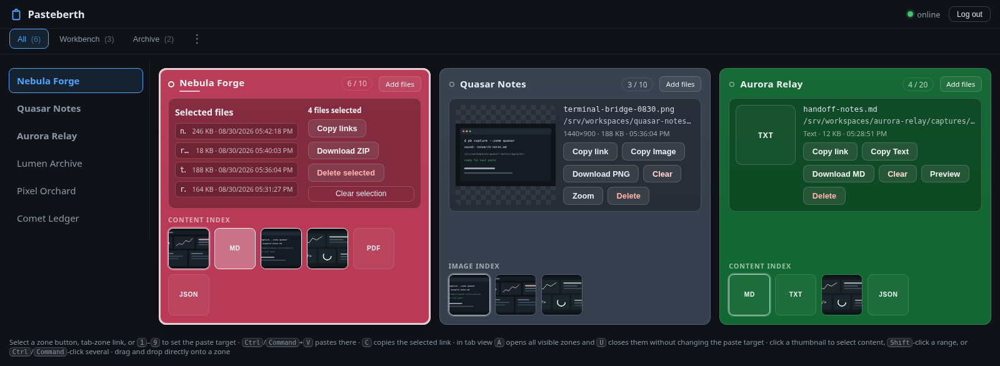

# Storage And Content Reference

[Documentation map](../../GUIDE.md).

## The Model

A zone is a real directory whose coherent data/sidecar pairs form the managed
contents. Browser, HTTP, CLI, and MCP clients provide different ways to publish
or use those contents; neither the producer nor the consumer has a fixed role.
`drop` uses the daemon, while `register` and local managed-pair commands can
operate without it. See [concepts](../concepts.md) for the overall model.

### What Pasteberth is for

Use zones as filesystem-backed staging areas, for one person's work or for
exchanges involving people, scripts, and agents. See [Using Pasteberth](../using-pasteberth.md)
for workflows and [provisioning](../provisioning.md) for multi-project discovery.

### What Pasteberth is not

The managed-pair contract does not make zones a cloud drive, synchronize
independent services, grant per-user Web permissions, or give browsers access
to local paths. See [deployment limits](../deployment.md#current-limits-and-roadmap)
and the [collection discovery contract](../zone-collection-contract.md).

## Filesystem Layout and Data Ownership

A managed item consists of a regular data file and a matching JSON sidecar:

```text
zone/
  report.pdf
  report.pdf.json
```

The sidecar records metadata such as `filename`, `created_at`, `size`,
`width`, `height`, `format`, `kind`, `mime`, and the content `sha256`. New
sidecars also record `creation_method` (`web_mouse_drop`, `web_paste`,
`filesystem_drop`, or `filesystem_register`) and the boolean `replaced`, which
is true only when a named managed file was replaced. `creation_method` is
descriptive metadata supplied by the client and validated against the allowed
vocabulary; it is not proof of who produced the file and must not be used as an
authorization, trust, or security decision. `duplicate` remains a response flag
for unnamed-content deduplication and does not rewrite the existing sidecar.
Older valid sidecar schemas without the digest remain readable; when needed, legacy
content is hashed on demand for duplicate detection. Pasteberth recognizes an
item only when the data file and sidecar are coherent. For a direct local
`drop`, the source bytes pass through a private staging file; the daemon
validates them and creates a new managed pair before removing the staging file.
An explicit `register` validates an existing regular file and creates or refreshes
only its sidecar; other foreign files remain outside managed operations.

Generated names use the form:

```text
YYYY-MM-DD_HH-MM-SS_<6 hex characters>.ext
```

For a browser drop, `preserve_name=1` retains a valid original filename. Names
default to 200 characters and 240 UTF-8 bytes; these two budgets are
configurable as `max_filename_length` and `max_filename_size`. Separators, NUL,
CR/LF, `.`/`..`, Pasteberth internal names, and transaction prefixes are rejected.
Names beginning with a dot, such as `.env`, are valid user names.

The following are internal and must not be edited or removed manually while a
service may be operating:

```text
.pasteberth.lock
.pbmeta-*
.pbdata-*
.pbdrop-*
.pbbackup-*
.pbtxn-*
.pbtrash-*
.pbrename-*
.pbdel-*
```

All names beginning with these prefixes are reserved for Pasteberth and are
rejected by new Web and CLI uploads. Older zones may contain a client file
named `.pbdel-...` with its matching `.json` sidecar; that ambiguous pair is
preserved as a foreign artifact during recovery and is never executed as a
deletion journal. Do not rename, edit, or remove it while investigating an old
zone.

Zone directories are deployment state and must remain outside the read-only
`PasteBerth/` directory. Back them up separately if their contents matter. For
a clean backup, stop the service and all CLI or external writers; copy managed
data and matching sidecars together. Do not treat foreign
files as managed Pasteberth content.

## Transaction Scope

Managed publication, replacement, rename, deletion, and recovery coordinate
through Pasteberth's operation locks, transaction records, and filesystem
identity checks. These protect cooperating Pasteberth processes and help
recovery distinguish owned transaction artifacts from foreign entries. They
are not a filesystem-wide transaction system.

A data file and its JSON sidecar are two directory entries. Arbitrary external
readers can observe intermediate states; arbitrary writers do not acquire
Pasteberth's locks. An editor, shell command, synchronizer, or another process
can change bytes or names outside the protocol. The service checks coherence
and preserves foreign objects, but cannot promise isolation, consistent
snapshots, or protection from all changes made by such writers. Stored digests
and `creation_method` are metadata, not signatures or an authorization record.

Prefer `drop --replace` for a controlled replacement. If a trusted external
producer must write directly, finish writing the regular file before
`register FILE`, then stop changing it while Pasteberth operates on it.
Registration preserves data bytes and applies local validation, not daemon
retention or zone policy; see [the CLI contract](cli.md#filesystem-register).

Batch transfers preflight conflicts, but can partially succeed after that
check. Move publishes the target pair before removing the source; it is not
an atomic cross-zone or cross-filesystem move. Inspect partial results before
retrying. Retention can also fail after a save has published an item.

Only supported local filesystems are within the official deployment boundary.
Network mounts and concurrent file synchronization are not made safe merely by
using this directory layout. For a consistent backup, stop the daemon and all
CLI or external writers; see [operations](../operations.md).

## Web UI

The browser view is a persistent workspace organized by zones.

This section preserves the precise browser/content contract. For a task-led
walkthrough, start with [Using Pasteberth](../using-pasteberth.md).


### Paste and drop

Click a zone or its selection button to make it the active paste target. Then:

- paste with `Ctrl+V` or `Command+V`;
- drop one or more files directly on a zone;
- use the file picker for one or more files.

Clipboard pastes accept images, text, and arbitrary files such as ZIP archives
or checksum files. Browser file drops use the original filename when it is
valid; a browser that exposes dropped files through `DataTransfer.items` is
supported as well as one that populates `DataTransfer.files`.

Focusing an action button or history item does not change the active paste
target. A direct drop always targets the zone under the pointer. Several files
are uploaded sequentially as independent operations; one failed file does not
cancel the others.

The web UI asks for confirmation before an upload would exceed `retain`, because
retention may remove existing managed items. The server's
[retention rules](#retention), including protection of the current publication,
remain authoritative.
A successful upload that removed items includes their filenames in the
`retention_deleted` response field; direct API clients should inspect it.

The server deduplicates unnamed uploads, including clipboard pastes, within
each zone. It computes the SHA-256 digest after receiving the bytes under the
zone lock; if the same content is already managed, the response is `200` with
`duplicate: true`, the existing item is returned, and retention is unchanged.
Uploads with a preserved filename remain independent so named files may
intentionally contain identical bytes. No hashing is performed in the browser.
Here, "unnamed" refers to generated filenames, not unauthenticated users.

After an upload, Pasteberth tries to copy the exact returned reference to the
clipboard. Clipboard permissions are controlled by the browser.

### Content types

- PNG, JPEG, and WebP images receive previews when structural validation passes.
- Valid UTF-8 content without NUL bytes is displayed as text.
- Other content is treated as opaque binary.
- A declared MIME type does not decide whether an image is valid; content
  inspection does.
- An image-looking file that fails structural validation remains a binary item
  if `accept_bin` permits it.
- Mixed clipboard input containing an image and text is stored as one HTML
  document with embedded images. `Copy Text` restores both HTML and plain-text
  clipboard flavors.
- When copying stored `text/html`, `Copy Text` removes scripts, event handlers,
  CSS, forms, remote URLs, and non-raster resources from the HTML clipboard
  flavor. Embedded raster `data:` images are retained. The preview displays the
  sanitized text and never renders stored HTML. If sanitization changed the
   document, it exposes a red `Copy raw HTML` button for an explicit raw copy;
   storage and downloads always keep the original file unchanged.

`Copy raw HTML` is an explicit exception to sanitized copying. Where rich
clipboard writing is supported, it puts the original HTML flavor on the
clipboard; otherwise it attempts to copy the raw source as text. A receiving
application may interpret the original HTML. Only use this action when that
destination and content are trusted; neither the raw-copy action nor a download
promises sanitized output.

Structural image validation checks containers, dimensions, chunk/segment
structure, and pixel budgets without fully decoding the codec bitstream. A
structurally valid but undecodable file can therefore have a broken preview;
the server never executes it. The default image budgets are `16,384 x 16,384`
pixels, 25 MP, and 256 MiB of encoded input; all are operator-configurable.

### After a deposit: inspect and act

The content index is the complete history for a zone, newest first. Click a
thumbnail or history item to select it in the upper panel.

- click selects one item;
- `Shift`-click selects a range;
- `Ctrl`-click or `Command`-click adds or removes an item;
- a multiple selection can copy all references, download a ZIP, or delete all
  selected managed items;
- the selected item exposes a `Comment` button for a short Unicode note;
- hovering the selected file or a history icon shows complete, untruncated item
  details;
- `show_full_path = false` hides absolute references in the UI while preserving
  them in API responses and copy actions.

For one selected item, the upper panel can copy its reference, preview or
download its content, copy image or text content when applicable, edit its
comment, or delete the managed pair. For several selected items, the panel
offers the corresponding group actions: copy all references, download a ZIP,
delete the selection, or copy or move the files to another configured zone.
These actions preserve stored filenames and metadata; a conflicting target is
rejected without replacing either side.

Related post-deposit operations are available outside the browser. Use the
filesystem commands in the [CLI reference](cli.md#command-line-interface) to rename,
delete, copy, or move managed pairs directly between configured zone
directories. Use the [HTTP API](api.md#http-api) for comments,
deletion, ZIP archives, and transfers from another client.

Visible browsers poll for changes made by `drop` or another client
every 10 seconds. A browser tab that was hidden refreshes when it becomes
visible. Newly discovered items display a `NEW` badge on the zone and history
item until that item is selected; this indicator is local to the browser tab and
is reset when the page is reloaded.



The `C` shortcut copies the selected item's link. In tab layout, `A` opens all
visible zones and `U` closes them without changing the paste target. `Shift`-
click selects the contiguous range from the last non-range zone selection;
`Ctrl`-click or `Command`-click adds or removes one zone, and the same
modifiers with `Shift` add or remove a range. Number keys `1` through `9`
select a visible zone. Keyboard focus and selection do not silently redirect
paste operations.

The selected-content panel provides the reference and applicable content actions
for one item. For several selected items it instead lists filenames, sizes, and
stored dates, and exposes the group actions. Individual preview/download actions
are not shown in that state.

### Retention

`retain = N` is the managed-item count target, not a time-to-live or byte quota.
The service applies retention after an upload or transfer under the zone lock,
protecting the filename currently being published. The remaining coherent
managed pairs are ordered by `(created_at, filename)`, descending: the newest
stored timestamp comes first, with descending filename as the tie-breaker.
Retention keeps the protected item plus the first `N - 1` other pairs and
removes the rest. It does not order by filesystem modification time.

An older incoming item is not removed by its own retention pass. With
`retain = 1`, it survives and can evict a newer resident item. Protection lasts
for that publication only: a later publication, including the next item in a
transfer batch, can evict it. The transfer result reports earlier targets
evicted during the batch as failures and keeps their move sources. Foreign
files and malformed or orphan sidecars are preserved. Unnamed duplicate uploads
do not run retention.

This is not a continuously enforced cap: local `register` does not run retention,
and cleanup can fail. A `503 retention_error` may follow a published save;
inspect history and logs before retrying. Lowering `retain` is not a background
garbage-collection schedule. Keep durable source files elsewhere if a later
deposit must not remove them.
